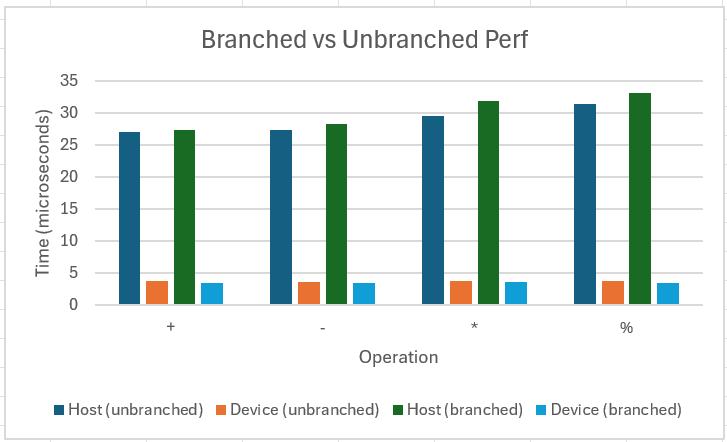

# Performance Comparison

Depicted below is the single-run performance of unbranched and device runs in each operation. The host time includes the time waiting for the GPU to compute its portion. Each test case was run over 1,000 iterations before averaging the result shown on the graph below.

